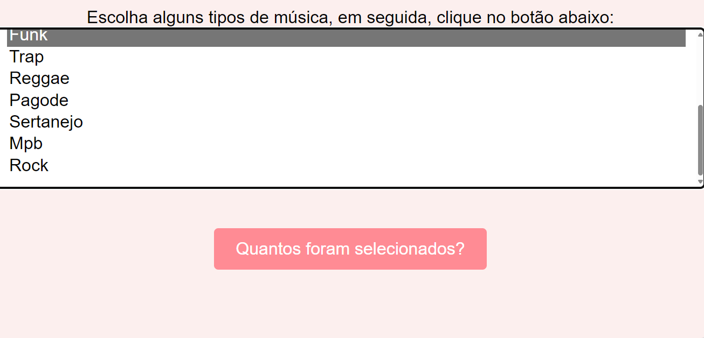

🎶🎵 **Projeto Laço de Repetição For - Adição de Tipos de Música** 🎵🎶

Bem-vindo ao meu projeto de implementação de um laço de repetição **for** em JavaScript! Este projeto inclui uma melhoria no código existente, onde mais três tipos de música são adicionados à lista de opções.

🎯 **Descrição da Tarefa:**

Este projeto consiste em implementar um laço de repetição **for** em JavaScript para contar opções selecionadas em um menu suspenso de tipos de música. Além disso, a tarefa requer a adição de mais três tipos de música à lista existente.

💻 **Explicação do Código:**

O elemento HTML select (<select>) representa um controle que apresenta um menu de opções. As opções dentro do menu são representadas pelo elemento <option>, que podem ser agrupados por elementos <optgroup>. As opções podem ser pré-selecionadas para o usuário.

- addEventListener() registra uma única espera de evento em um único alvo. O alvo do evento pode ser um único elemento em um documento, o documento em si, uma janela, ou um XMLHttpRequest.

Resumindo, o elemento <select> é usado para criar menus suspensos de opções em páginas da web, enquanto o método addEventListener() em JavaScript é usado para adicionar interatividade aos elementos HTML.

## Fontes: [https://developer.mozilla.org/pt-BR/docs/Web/API/EventTarget/addEventListener]
[https://developer.mozilla.org/pt-BR/docs/Web/HTML/Element/select]

🎵 **Adição de Tipos de Música:**

No meu projeto coloquei mais que 3  tipos de música foram adicionados à lista existente de opções no menu suspenso. Isso amplia a variedade de escolhas disponíveis para o usuário.

## Ilustração do meu projeto

📝 **Autora**

produzido por Luamy Alves Gama.

# 🎉 linkedin
Este projeto será documentado no LinkedIn para compartilhar meu trabalho e experiência com a comunidade.

Divirta-se explorando os diferentes tipos de música disponíveis!
